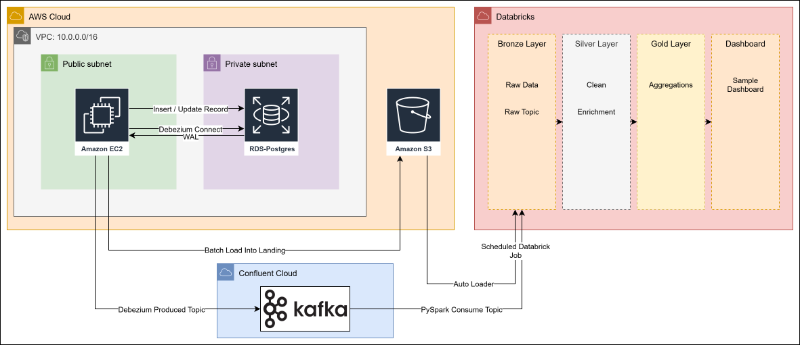
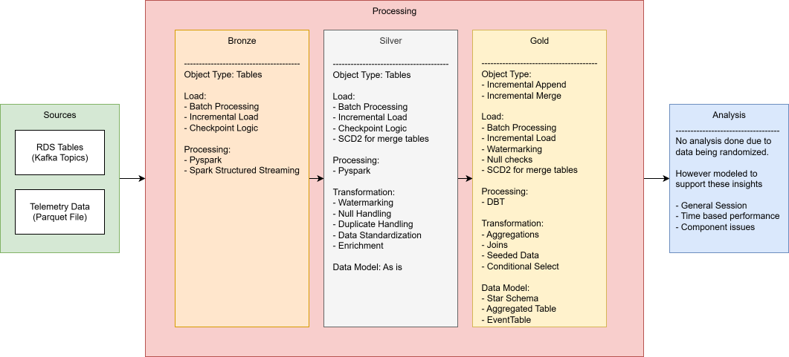

# Motorsport Telemetry Data Lakehouse

A synthetic data engineering pipeline that tracks common motorsport vehicle
telemetry: change-data-capture from an operational database, streaming and
batch ingestion into a medallion lakehouse, and an incremental dbt gold
layer, orchestrated end to end on a schedule.

This is a portfolio project. All data is synthetic and generated by the
scripts in this repo. The project is intentionally scoped to demonstrate
production-realistic pipeline engineering, not analytics, ML, or a live
product.

## What this is (and isn't)

- **Is**: infrastructure for delivering vehicle telemetry and session data
  from an operational store to an analytical lakehouse, with correct
  history tracking and tested transformations.
- **Isn't**: a live dashboard, a race-analysis tool, or a predictive
  system. Detection logic, delta-time comparison, predictive maintenance,
  and corner timing are explicitly out of scope — that's for a downstream
  consumer to build on top of this data.
- **Isn't real-time.** Data is refreshed on a schedule (see
  [Orchestration](#orchestration)), not streamed to a live consumer.
  This was a deliberate choice — see
  [Why not real-time?](#why-not-real-time)

## Running this yourself
See [Deployment Guide](deployment.md) for instructions to setup and execute the
system.

## Architecture

```
 Generators (EC2, Docker)
    |
    |-- writes rows --> RDS Postgres  --(Debezium CDC / WAL)--> Kafka (Confluent Cloud)
    |                                                                |
    +-- writes files --> S3 landing/ (Parquet)                       |
                              |                                      |
                              v                                      v
                    Databricks Auto Loader                 Databricks Structured Streaming
                              |                                      |
                              v                                      v
                    +----------------------- Bronze (Delta) -----------------------+
                                              |
                                              v
                                      Silver (Delta)
                              (typed, deduplicated, SCD1/SCD2 history)
                                              |
                                              v
                                   Gold (dbt, incremental)
                          (dims, facts, tests, built on Databricks)
```

**Why this shape:** CDC (Debezium → Kafka) captures every change to the
operational schema — including deletes and intermediate states — which a
polling query against Postgres would miss. Telemetry is high-volume and
append-only, so it bypasses the operational database entirely and lands in
S3 directly from the generator. Both paths converge in bronze, get cleaned
and versioned in silver, and are modeled into a dimensional gold layer.

## Data Architecture


## Gold layer entity relationships
```
                         dim_drivers (SCD1)
                         driver_id (PK)
                              ^
                              |
        +---------------------+---------------------+
        |                                            |
   dim_vehicles (SCD2)                          fct_sessions
   vehicle_id + version_number (PK)             session_id (PK)
   driver_id (FK, owner)                        driver_id (FK)
        ^                                        vehicle_id (FK)
        |                                        track_id (FK)
        +----------------------------------------+
                              |
                    +---------+---------+
                    |                   |
             fct_section_times    fct_warning
             session_id (FK)      session_id (FK)
             + lap + section_num  + sensor_name + reading_ts
             (grain, no own PK)   (grain, no own PK)
                    |                   |
                    v                   v
            dim_track_sections      sensors (dbt seed)
            section_id (PK)         sensor_name (PK)
            track_id (FK)
                    |
                    v
               dim_tracks
               track_id (PK)
```
Checkout [Data Architecture](docs/DATA_MODEL.svg) for more details

Checkout [Schema Reference](docs/SCHEMEA_REFERENCE.md) for details about scheams


## Repository layout

```
├── infra/                  Terraform: aws/, confluent/, bootstrap/
├── docs/                   Dump for design and config files without dedicated folder
├── src/generators/         Synthetic data generators (metadata, telemetry)
├── notebooks/              Databricks notebooks, executes transformations / ingestion
├── src/pipeline/           Logic libraries that transform data
├── dbt/                    dbt project (gold layer models, tests, seeds)
├── db/                     RDS schema and seed SQL
├── debezium/               Kafka Connect / Debezium init scripts
└── docker-compose.yml      Kafka Connect + generator services (EC2)
```

## Data flow in detail

**Operational schema (RDS Postgres):** `drivers`, `vehicles`, `tracks`,
`track_sections`, `sessions`. A separate `sensors` seed table (dbt seed,
not RDS) defines sensor names and physical valid ranges.

**CDC path:** Debezium captures inserts/updates/deletes from Postgres via
`pgoutput` logical replication and publishes them to per-table Kafka
topics. A generic bronze notebook consumes each topic with Databricks
Auto Loader / Structured Streaming (`availableNow`) into
`bronze.cdc_<table>`. A generic silver notebook rebuilds each silver table
from bronze per run, using a small registry (key, schema, SCD flag) to
decide behavior per table.

**Telemetry path:** The generator writes one Parquet file to S3
`landing/` per session. Auto Loader ingests new files into
`bronze.telemetry`. Silver telemetry is append-only, joins session and
track-section context from silver, and derives lap/section from GPS
position. Sessions not yet present in silver are skipped and picked up on
a later run (see [Known limitations](#known-limitations)).

**Gold layer (dbt, incremental):** dims (`dim_drivers`, `dim_tracks`,
`dim_track_sections`, `dim_vehicles`) and facts (`fct_sessions`,
`fct_section_times`, `fct_warning`), built directly from silver with no
staging layer, since silver already serves that role. `dim_vehicles` is
the only true SCD2 dimension — vehicles cannot be edited while assigned
to an open session, which keeps a vehicle's version aligned with session
boundaries. All other dims are SCD1 (latest state).

## Orchestration

6 databrick task branches that run in parrallel (one for each table), 
one schedule:

```
ingest_cdc_*     → process_cdc_*       |→ dbt build
ingest_telemetry → process_telemetry   |  
```

- **Schedule:** every 15 minutes (cron).
- **Max concurrent runs:** 1, queueing off — an overrunning tick is
  skipped, and the next run drains whatever accumulated. Silver's
  watermark- and checkpoint-based design makes this safe.
- **Ordering is deliberate:** CDC must land in silver before telemetry
  processing, so a session's dimension data exists before its telemetry
  is modeled. Forcing dbt to be dependent on all process_* tasks being 
  successful gaurentees this.
- **dbt runs last, every cycle.** Gold models are incremental, so this is
  cheap even at a tight interval.

A maintenance Job runs `OPTIMIZE`/`VACUUM` nightly on bronze and silver,
since a 20-minute cadence produces many small file commits over an
extended run.

## Why not real-time?

CDC and streaming infrastructure are used here for **correctness**, not
**latency**. Debezium reads the Postgres WAL, which is the only way to
capture every intermediate change (including deletes) without expensive
polling — that's necessary for reconstructing accurate SCD2 history in
`dim_vehicles`, regardless of how often the data is consumed downstream.

Low-latency delivery was cut early (see
[decisions log](#decisions--simplifications)) along with the live
dashboard it would have served. With no consumer reading gold within
seconds of ingestion, running dbt continuously or keeping compute always
on would add cost and complexity with no one benefiting from the
freshness. Scheduled micro-batching gets the same correctness at a
fraction of the operating cost.

## Testing

dbt tests cover:

- **Uniqueness and grain**: `unique`/`not_null` on primary keys,
  `dbt_utils.unique_combination_of_columns` on composite grains
  (`fct_section_times`, `fct_warning`, `dim_track_sections`).
- **Referential integrity**: `relationships` tests from facts to dims.
- **Domain logic (singular tests)**: no overlapping `dim_vehicles`
  versions, at most one open version per vehicle, session-to-vehicle
  version alignment, session duration consistency, row-count parity
  between silver and gold.

Run with `dbt build`, which sequences seed → run → test.

## Known limitations

Documented here as deliberate simplifications, not oversights:

- **Eventual consistency between CDC and telemetry.** A telemetry file
  can arrive before its session's CDC row reaches silver. The silver
  telemetry watermark skips such sessions until they appear; nothing is
  dropped, but a session can lag by one pipeline cycle.
- **Silver CDC is a full rebuild from bronze**, not incremental, for
  simplicity. This is inexpensive at this data volume; an incremental
  merge (tracked as future work) would be needed at meaningfully higher
  event rates.
- **`dim_vehicles` carries no version reference in `fct_sessions`** — the
  active version at session time can be recovered by joining on session
  timing, but is not pre-resolved in the fact table.
- **Sessions with no `end_time`** (a generator crash or restart mid-run)
  are excluded from gold until closed; a small number of orphaned
  sessions from a hard restart is expected and accepted.
- **Auto Loader uses directory listing**, not file-event notifications,
  to avoid provisioning a Databricks-managed SNS/SQS resource outside
  Terraform. Fine at this file volume; would need reconsideration at
  much higher throughput.
- **The RDS master password is stored in Terraform state.** An
  RDS-managed master password (rotated outside Terraform) is the
  hardening path, deferred here.
- **Databricks is not deployed using Terraform.** The free trial version of 
  Databricks places a one workspace limit and only support serverless compute

## Decisions & simplifications
- **Original Plan simpliified.** Originally sensor records were supposed to be 
  streamed and batch ingested, however was simplified to only batch ingested
  because streaming the data had no use due to my inability to think of a use
  for them (did not want to use it just redundant data).
- **AWS infrastructure was not built with best security.** The cloud infra 
  created leaves alot to be desired from a role and security persepective. 
  This tradeoff was made because of the project being data engineering focused.
- **Switched to confluent for kafka hosting.** This was due to the workspace
  being serverless only. Additionally, confluent was just the more interesting
  tool
- **Databricks is not deployed using Terraform.** The free trial version of 
  Databricks places a one workspace limit and only support serverless compute.
- **Batch ingested/processed rather than Live data.** This decision was made to
  keep costs low, and because the data gathered did not need to be ready 
  immediately. The system created is more of OLAP purposes.
- **CI/CD was scoped and cut.** Jobs are built by hand in the Databricks
  UI and exported to `docs/databricks_jobs.yml` for reproducibility, rather 
  than deployed via Asset Bundles and GitHub Actions. This was a consequence 
  of project burnout and time constraints
